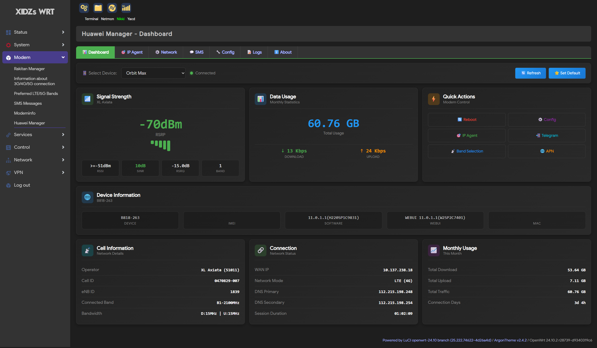

# Huawei Manager for OpenWrt

Comprehensive Huawei LTE modem management tool for OpenWrt. This package combines real-time dashboard monitoring, IP automation (IP Agent), network configuration, SMS management, and Telegram notifications in a single, intuitive interface.



## Features

### 📊 Real-time Dashboard

- **Signal Monitoring**: RSRP, RSRQ, SINR, RSSI with visual indicators
- **Traffic Statistics**: Download/upload rates, total usage (monthly)
- **Device Information**: Model, IMEI, WAN IP, firmware, MAC address
- **Cell Information**: Operator, Cell ID, eNB ID, Connected Band (with CA support)
- **Quick Actions**: Reboot, Config, IP Agent, Telegram, Band Selection, APN
- **Auto-refresh**: Real-time updates every 5 seconds
- **Default Device**: Set a default device to auto-select on page load

### 🎯 IP Agent (Automatic IP Hunting)

- **Multi-device Support**: Monitor multiple modems independently
- **Flexible IP Targeting**: Define target IP prefixes or ranges
- **Multiple Reconnection Methods**:
  - Mobile Data Toggle (fast)
  - Network Mode Switch (reliable)
  - Profile Switch
  - Reboot (thorough)
- **Metrics Tracking**: Reconnect count, uptime, IP history
- **Telegram Notifications**: Alerts when target IP is found

### 📡 Network Settings

- **Band Selection**: Select LTE bands interactively
- **APN Management**: Create, edit, delete, set default APN profiles
- **USSD**: Send USSD codes and view responses

### 📱 SMS Management

- **Inbox View**: Read incoming messages with unread indicators
- **Send SMS**: Compose and send messages
- **Bulk Actions**: Select all, mark as read, delete multiple
- **Filters**: View all or unread only

### 📲 Telegram Notifications

- **Target IP Found**: Notify when desired IP is obtained
- **Reconnection Events**: Alert on modem reconnections
- **Error Notifications**: Optional error reporting
- **Smart Retry**: Robust delivery with retry mechanism

### 📝 Logging

- **Comprehensive Logging**: All events with timestamps
- **Log Rotation**: Automatic rotation to prevent disk overflow
- **Web Viewer**: Filter by level (Info, Warning, Error)
- **Auto-refresh**: Real-time log updates

## Requirements

- OpenWrt 21.02 or later
- Python 3.x with pip
- LuCI web interface
- huawei-lte-api Python package (auto-installed)

## Installation

### Option 1: Quick Install (Recommended)

Jalankan command berikut di terminal OpenWrt:

```bash
# Install langsung
wget -qO- https://raw.githubusercontent.com/rdk-i/huawei-manager/main/install.sh | sh -s -- install

# Update ke versi terbaru
wget -qO- https://raw.githubusercontent.com/rdk-i/huawei-manager/main/install.sh | sh -s -- update

# Hapus aplikasi
wget -qO- https://raw.githubusercontent.com/rdk-i/huawei-manager/main/install.sh | sh -s -- remove
```

Atau unduh dan jalankan script secara manual (dengan menu interaktif):

```bash
wget https://raw.githubusercontent.com/rdk-i/huawei-manager/main/install.sh
chmod +x install.sh
./install.sh
```

Script ini menyediakan opsi:
- **install** - Instal Huawei Manager dari rilis terbaru
- **update** - Perbarui ke versi terbaru (konfigurasi user tetap terjaga)
- **remove** - Hapus Huawei Manager

### Option 2: Manual Install (Pre-built Package)

```bash
# Install dependencies
opkg update
opkg install python3 python3-pip

# Download latest release from GitHub
wget https://github.com/rdk-i/huawei-manager/releases/latest/download/huawei-manager_1.0.0-1_all.ipk

# Install package
opkg install huawei-manager_1.0.0-1_all.ipk

# The package will auto-install huawei-lte-api
```

### Option 3: Build from Source

```bash
# In WSL/Linux with OpenWrt SDK
# Navigate to project root (where build.sh, Makefile, files/, luasrc/ are located)
./build.sh
```

## Configuration

### Via LuCI Web Interface

1. Navigate to **Modem → Huawei Manager**
2. Go to **Config** tab
3. Add devices with:
   - **Device Name**: Friendly name (e.g., "Orbit Max")
   - **Modem URL**: e.g., `http://192.168.8.1/` or `https://192.168.7.1/`
   - **Username/Password**: Modem credentials
4. Configure **IP Agent** tab (optional):
   - Enable IP Agent
   - Set target IP prefixes (e.g., `10.1-10.19`)
   - Choose reconnection method
5. Configure **Telegram** tab (optional):
   - Enable notifications
   - Set Bot Token and Chat ID
   - Choose notification events
6. Click **Save & Apply**

### Via UCI Command Line

```bash
# Add device
uci set huawei-manager.modem1=device
uci set huawei-manager.modem1.name='My Modem'
uci set huawei-manager.modem1.modem_url='http://192.168.8.1/'
uci set huawei-manager.modem1.modem_username='admin'
uci set huawei-manager.modem1.modem_password='admin'

# IP Agent settings
uci set huawei-manager.modem1.ipagent_enabled='1'
uci add_list huawei-manager.modem1.target_prefixes='10.1-10.19'
uci set huawei-manager.modem1.reconnect_method='data'
uci set huawei-manager.modem1.check_interval='10'

# Telegram settings (optional)
uci set huawei-manager.modem1.telegram_enabled='1'
uci set huawei-manager.modem1.telegram_bot_token='YOUR_BOT_TOKEN'
uci set huawei-manager.modem1.telegram_chat_id='YOUR_CHAT_ID'
uci set huawei-manager.modem1.telegram_notify_found='1'
uci set huawei-manager.modem1.telegram_notify_reconnect='1'

# Apply
uci commit huawei-manager
/etc/init.d/huawei-manager restart
```

## Service Management

```bash
# Start/Stop/Restart
/etc/init.d/huawei-manager start
/etc/init.d/huawei-manager stop
/etc/init.d/huawei-manager restart

# Enable/Disable on boot
/etc/init.d/huawei-manager enable
/etc/init.d/huawei-manager disable

# View logs
tail -f /var/log/huawei-manager.log
```

## Supported Modems

Tested with:

- Huawei B818-263 (Orbit Max)
- Huawei H153-381 (Orbit 5G)
- Other Huawei LTE/5G modems with web interface

## Project Structure

```
huawei-manager/
├── Makefile                         # OpenWrt package definition
├── install.sh                       # Interactive installer script
├── build.sh                         # Build script for SDK
├── files/
│   ├── etc/
│   │   ├── config/huawei-manager    # UCI configuration
│   │   └── init.d/huawei-manager    # Init script (procd)
│   └── usr/bin/huawei-manager/
│       ├── modem_api.py             # CLI for modem operations
│       ├── device_info.py           # Get WAN IP utility
│       ├── reconnect_dialup.py      # Reconnection methods
│       ├── ip_agent_daemon.py       # IP hunting daemon
│       └── utils.py                 # Shared utilities
└── luasrc/
    ├── controller/huawei-manager.lua    # API routes
    ├── model/cbi/huawei-manager.lua     # Configuration form
    └── view/huawei-manager/
        ├── dashboard.htm            # Real-time monitoring
        ├── ip_agent.htm             # IP hunting status
        ├── network.htm              # Band/APN/USSD
        ├── sms.htm                  # SMS management
        ├── logs.htm                 # Log viewer
        └── about.htm                # About page
```

## Troubleshooting

### Service not starting

```bash
# Check status
/etc/init.d/huawei-manager status

# Check logs
cat /var/log/huawei-manager.log

# Test Python and dependencies
python3 -c "from huawei_lte_api.Client import Client; print('OK')"
```

### Web interface not loading

```bash
# Restart uhttpd
/etc/init.d/uhttpd restart

# Clear LuCI cache
rm -rf /tmp/luci-*
```

### Modem connection issues

- Verify modem URL is accessible from router
- Check username/password are correct
- Ensure modem is not locked by another session
- Try logging out of modem web interface first

### SSL Certificate Errors (HTTPS modems)

The package handles self-signed certificates automatically. If issues persist:

- Try using HTTP instead of HTTPS
- Ensure modem firmware is up to date

## License

MIT License

## Author

Developed by **Must_A_Kim**

[](http://t.me/must_a_kim)

## Support

If you find this project useful, consider supporting the development:

[](https://saweria.co/must0a0kim)

## Credits

- [huawei-lte-api](https://github.com/Salamek/huawei-lte-api) - Python library for Huawei modems
- Built for OpenWrt LuCI
